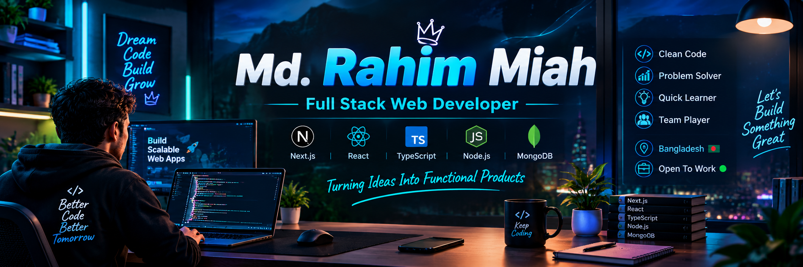

<!-- ==================== 3D PREMIUM BANNER ==================== -->

  

<!-- ==================== TYPING HEADER ==================== -->

  

<!-- ==================== PROFILE BADGES ==================== -->

&nbsp;

&nbsp;

&nbsp;

 

---

# 👨‍💻 About Me

Hi! I'm **Md. Rahim Miah**, a passionate **Full Stack Web Developer** from Bangladesh.

- 🚀 I'm currently working on **React.js, Next.js, Express.js** for designing clean and user-friendly UIs.
- 🤖 I'm currently learning **TypeScript, AI integrations, DSA & Problem Solving**.
- ✨ I'm focused on building **fast & intuitive AI-powered products**.
- 🌐 All of my projects are available at [https://rahim-digital-portfolio.netlify.app](https://rahim-digital-portfolio.netlify.app)
- 📫 Reach me at **Email** and **LinkedIn**
- ⚡ **Fun Fact:** I love learning new technologies and solving real-world problems.

---

# 🛠️ Tech Stack & Capabilities

### 🎨 Frontend Engineering

`HTML5` • `CSS3` • `JavaScript` • `TypeScript` • `React` • `Next.js` • `Tailwind CSS`

---

### ⚙️ Backend & Architecture

`Node.js` • `Express.js` • `MongoDB` • `Firebase` • `Prisma ORM`

---

### 🛠️ Workflow & Infrastructure Tools

`VS Code` • `Git` • `GitHub` • `Postman` • `Vercel` • `Netlify`

---

# 🏆 GitHub Trophies

---

# 🚀 Featured Production Projects

### ⚽ SquadCraft
**Sports Management & Tactical Planning Platform**

Full-stack football management platform featuring interactive squad arrangement builders, tactical lineup configurations, and team roster management.

**Key Tech:** `Next.js 15` • `Tailwind CSS` • `Node.js` • `MongoDB` • `JWT`

&nbsp;

---

### 🏥 MediCare Connect
**Healthcare Digital Ecosystem & Telemedicine**

Comprehensive healthcare web portal enabling online doctor consultations, appointment booking, Stripe payment integration, and real-time patient management.

**Key Tech:** `Next.js` • `Express.js` • `MongoDB` • `Stripe` • `Framer Motion`

&nbsp;

---

# 📊 Analytics & Coding Contributions

 

---

# 📈 Contribution Graph

---

# 💭 Developer Mindset

---

# 📬 Let's Connect & Collaborate

I'm open to **full-time remote/onsite Full Stack Developer positions**, freelance contracts, and open-source contributions.

&nbsp;

&nbsp;

  

 

---

### ⭐ If you find my work interesting, feel free to explore my repositories!

 

**💻 Code • 🚀 Build • 🧠 Learn • 🔥 Improve • 🔁 Repeat**

